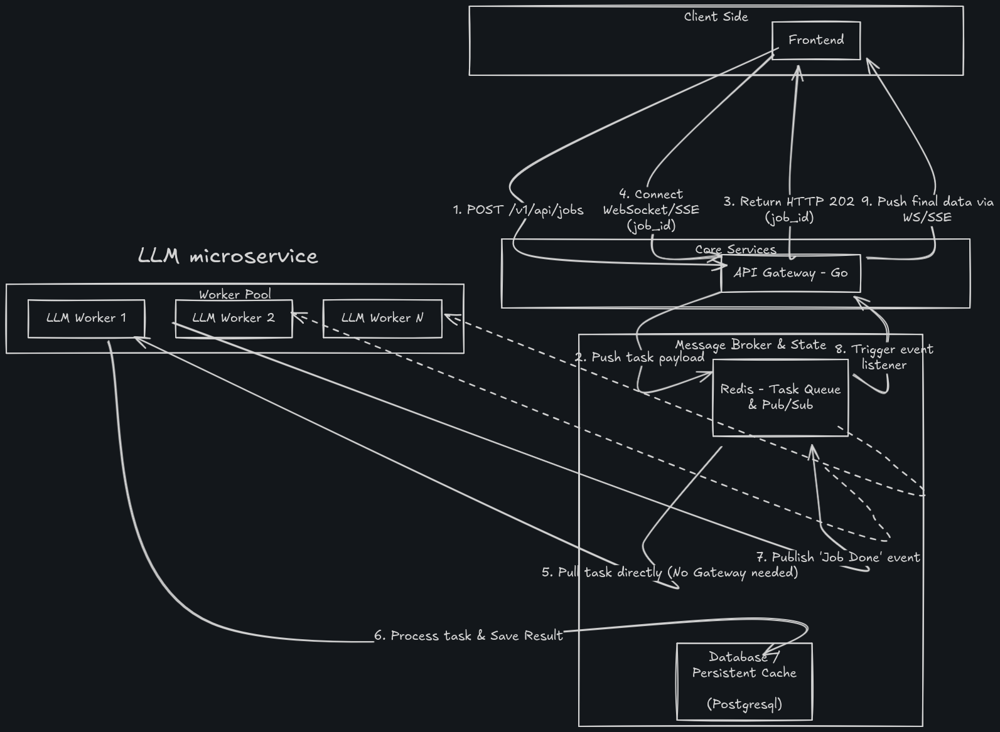
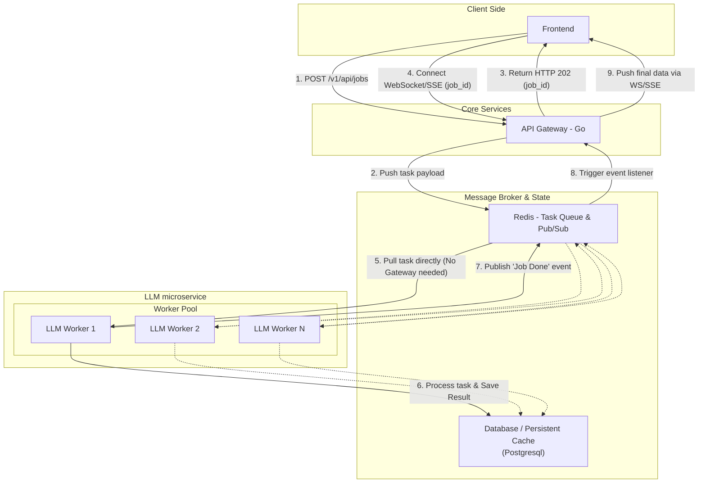

# Tox-Detector Backend (Go)

A high-performance, event-driven toxicity prediction API built with **Go (Gin)**, **PostgreSQL (Supabase)**, **Redis (Upstash)**, and a **Python ML worker**. Accepts a SMILES string, predicts toxicity via an ML model, and streams the result back to the client in real-time over WebSockets.



---

## 🏗️ Architecture Flow



1. **Cache check**: Before enqueuing, the Go handler queries PostgreSQL for an existing `completed` result for the same SMILES. If found, returns it immediately (`200 OK`) — no model inference runs.
2. **Ingest** *(cache miss)*: Saves a `queued` row in PostgreSQL and pushes to a Redis Stream, returning a `job_id` (`202 Accepted`).
3. **Worker**: Python worker reads from the stream, runs ML inference, updates PostgreSQL to `completed`, and publishes the `job_id` to a Redis Pub/Sub channel.
4. **Delivery**: The Go Pub/Sub listener receives the event, fetches the completed prediction, and pushes the result to the waiting WebSocket client before closing the connection.

---

## 📁 Folder Structure

```
tox-backend/
├── config/          # DB & Redis init, global WebSocket client map
├── handlers/        # Route handlers (auth, jobs, health)
├── middleware/      # JWT authentication middleware
├── models/          # GORM models (User, Prediction)
├── worker/          # Redis Pub/Sub subscriber goroutine
├── python-worker/   # Standalone Python ML inference worker
├── main.go          # App entry point & route registration
└── supabase_migration.sql  # DB schema for Supabase
```

---

## 🚀 Setup & Requirements

### Environment Variables (`.env`)

```env
# PostgreSQL (Supabase)
DATABASE_URL=postgresql://postgres:<password>@<host>:<port>/postgres

# Redis (Upstash — TLS)
UPSTASH_REDIS_URL=rediss://default:<password>@<host>.upstash.io:6379

# JWT
JWT_SECRET=your-secret-key

# Supabase (for OAuth redirect)
NEXT_PUBLIC_SUPABASE_URL=https://your-project.supabase.co
SUPABASE_JWT_SECRET=your-supabase-jwt-secret
```

### Running Locally

```bash
# Go backend
go mod tidy
go run main.go
# → http://localhost:8080

# Python ML worker (separate terminal)
cd python-worker
python -m venv venv
source venv/bin/activate
pip install -r requirements.txt
python worker.py
```

### Running Tests

The Go backend includes automated tests for all handlers (auth, health, jobs caching). These tests use an isolated in-memory SQLite database and Miniredis to run without external dependencies. 

```bash
# Run all Go tests
go test ./tests/... -v
```

> The `docker-compose.yml` / `Dockerfile` are for production deployments or running local Postgres/Redis instances.

---

## 🔒 Authentication

All `/v1/api/*` endpoints require a valid **Bearer JWT**. You can provide this in one of two ways:
1. `Authorization: Bearer <token>` (Header)
2. `?token=<token>` (Query parameter — useful for WebSockets)

The middleware accepts tokens issued by both this backend's `/auth/login` and Supabase Auth (HS256).

---

## 🔌 API Endpoints

### Health Check

```
GET /health
```

**Response `200 OK`**
```json
{
  "status": "healthy",
  "postgres": "ok",
  "redis": "ok"
}
```

**Response `503 Service Unavailable`** (if a dependency is down)
```json
{
  "status": "unhealthy",
  "postgres": "dial tcp: connection refused"
}
```

---

### Auth — Sign Up

```
POST /auth/signup
Content-Type: application/json
```

**Request**
```json
{
  "email": "alice@example.com",
  "password": "securepassword"
}
```

**Response `201 Created`**
```json
{
  "message": "User registered successfully",
  "user_id": 1
}
```

**Response `409 Conflict`** (email already exists)
```json
{
  "error": "Email already exists"
}
```

---

### Auth — Login

```
POST /auth/login
Content-Type: application/json
```

**Request**
```json
{
  "email": "alice@example.com",
  "password": "securepassword"
}
```

**Response `200 OK`**
```json
{
  "message": "Login successful",
  "token": "eyJhbGciOiJIUzI1NiIsInR5cCI6IkpXVCJ9..."
}
```

**Response `401 Unauthorized`**
```json
{
  "error": "Invalid email or password"
}
```

---

### Auth — Logout

```
POST /auth/logout
```

**Response `200 OK`**
```json
{
  "message": "Logged out successfully. Please discard the token on the client."
}
```

---

### Auth — OAuth Redirect

```
GET /auth/oauth/:provider?redirect_to=<url>
```

Redirects to Supabase's OAuth authorization page for the given provider (e.g. `google`, `github`). The frontend receives the callback; Supabase-issued HS256 tokens are natively accepted by this backend's `AuthMiddleware`.

**Response**: `307 Temporary Redirect` → `https://<supabase-url>/auth/v1/authorize?provider=google`

---

### Ingest Job *(protected)*

```
POST /v1/api/jobs
Authorization: Bearer <token>
Content-Type: application/json
```

**Request**
```json
{
  "smiles": "CC(=O)Oc1ccccc1C(=O)O"
}
```

**Response `200 OK`** — *cache hit* (SMILES was already processed; full result returned immediately, no WebSocket needed)
```json
{
  "job_id": "9fae1055-7507-44ed-858c-1fe12c0d922c",
  "status": "completed",
  "smiles_input": "CC(=O)Oc1ccccc1C(=O)O",
  "tox_score": 0.1523,
  "tox_class": "Non-toxic",
  "llm_explanation": "..."
}
```

**Response `202 Accepted`** — *cache miss* (new job queued; connect via WebSocket to receive the result)
```json
{
  "job_id": "9fae1055-7507-44ed-858c-1fe12c0d922c",
  "status": "queued"
}
```

**Response `400 Bad Request`** (missing `smiles`)
```json
{
  "error": "Invalid request payload: Key: 'smiles' Error:Field validation for 'smiles' failed on the 'required' tag"
}
```

**Response `500 Internal Server Error`** (Redis/DB failure)
```json
{
  "error": "Failed to enqueue job"
}
```

---

### Job Result — WebSocket *(protected)*

```
GET /v1/api/jobs/ws/:job_id?token=<token>
Upgrade: websocket
```

Upgrades the HTTP connection to a WebSocket. The connection stays open until the ML worker completes the job, at which point the server pushes a single JSON frame and closes the connection.

> **Fast-path**: If the job is already `completed` in the DB at connection time, the server pushes the result immediately without waiting.

**WebSocket frame (pushed by server on completion)**
```json
{
  "job_id": "9fae1055-7507-44ed-858c-1fe12c0d922c",
  "status": "completed",
  "smiles_input": "CC(=O)Oc1ccccc1C(=O)O",
  "tox_score": 0.1523,
  "tox_class": "Non-toxic",
  "llm_explanation": "The compound CC(=O)Oc1ccccc1... shows very low predicted toxicity (score 0.1523)."
}
```

| Field | Type | Description |
|---|---|---|
| `job_id` | string (UUID) | Unique job identifier |
| `status` | string | `queued` \| `processing` \| `completed` \| `failed` |
| `smiles_input` | string | Original SMILES string submitted |
| `tox_score` | float | Toxicity score from 0.0 (safe) to 1.0 (highly toxic) |
| `tox_class` | string | `Non-toxic` \| `Low` \| `Moderate` \| `High` |
| `llm_explanation` | string | Human-readable explanation of the prediction |

---

## 🐍 Python Worker

The `python-worker/worker.py` service runs independently and:

1. Joins the `python-llm-workers` consumer group on the `llm_task_queue` Redis Stream.
2. For each message, updates the prediction to `processing`, runs the real **RDKit + LightGBM/XGBoost ensemble** model, updates to `completed`, and publishes to `job_completed_events`.
3. Acknowledges the stream message to prevent re-delivery.
4. Falls back to mock inference automatically if `toxicity_model.pkl` is not present (run `python train.py --csv /path/to/tox21.csv` to generate it).

> **Cache note:** The Python worker only receives jobs that were a **cache miss** in the Go handler. Duplicate SMILES are short-circuited before they ever reach the stream.

---

## 🗄️ Database Schema


Run `supabase_migration.sql` on your Supabase project to set up the `predictions` and `users` tables. GORM `AutoMigrate` is also enabled at startup as a fallback.
