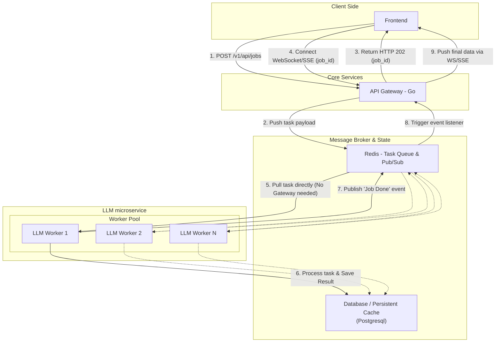

# Tox-Detector Backend (Go)

A high-performance, event-driven toxicity prediction API built with **Go (Gin)**, **PostgreSQL (Supabase)**, **Redis (Upstash)**, and a **Python ML worker**. Accepts a SMILES string, predicts toxicity via an ML model, and streams the result back to the client in real-time over WebSockets.


---

## 🏗️ Architecture Flow



1. **Cache check**: Before enqueuing, the Go handler queries PostgreSQL for an existing `completed` result for the same SMILES. If found, returns it immediately (`200 OK`) — no model inference runs.
2. **Ingest** *(cache miss)*: Saves a `queued` row in PostgreSQL and pushes to a Redis Stream, returning a `job_id` (`202 Accepted`).
3. **Worker**: Python worker reads from the stream, runs ML inference, updates PostgreSQL to `completed`, and publishes the `job_id` to a Redis Pub/Sub channel.
4. **Delivery**: The Go Pub/Sub listener receives the event, fetches the completed prediction, and pushes the result to the waiting WebSocket client before closing the connection.

---

## 📁 Folder Structure

```
tox-backend/
├── config/          # DB & Redis init, global WebSocket client map
├── handlers/        # Route handlers (auth, jobs, health)
├── middleware/      # JWT authentication middleware
├── models/          # GORM models (User, Prediction)
├── worker/          # Redis Pub/Sub subscriber goroutine
├── python-worker/   # Standalone Python ML inference worker
├── main.go          # App entry point & route registration
└── supabase_migration.sql  # DB schema for Supabase
```

---

## 🚀 Setup & Requirements

### Environment Variables (`.env`)

```env
# PostgreSQL (Supabase)
DATABASE_URL=postgresql://postgres:<password>@<host>:<port>/postgres

# Redis (Upstash — TLS)
UPSTASH_REDIS_URL=rediss://default:<password>@<host>.upstash.io:6379

# JWT
JWT_SECRET=your-secret-key

# Supabase (for OAuth redirect)
NEXT_PUBLIC_SUPABASE_URL=https://your-project.supabase.co
SUPABASE_JWT_SECRET=your-supabase-jwt-secret
```

### Running Locally

```bash
# Go backend
go mod tidy
go run main.go
# → http://localhost:8080

# Python ML worker (separate terminal)
cd python-worker
python -m venv venv
source venv/bin/activate
pip install -r requirements.txt
python worker.py
```

### Running Tests

The Go backend includes automated tests for all handlers (auth, health, jobs caching). These tests use an isolated in-memory SQLite database and Miniredis to run without external dependencies. 

```bash
# Run all Go tests
go test ./tests/... -v
```

> The `docker-compose.yml` / `Dockerfile` are for production deployments or running local Postgres/Redis instances.

---

## 🔒 Authentication

All `/v1/api/*` endpoints require a valid **Bearer JWT**. You can provide this in one of two ways:
1. `Authorization: Bearer <token>` (Header)
2. `?token=<token>` (Query parameter — useful for WebSockets)

The middleware accepts tokens issued by both this backend's `/auth/login` and Supabase Auth (HS256).

---

## 🔌 API Endpoints

### 1. Health Check
Checks if the API, PostgreSQL, and Redis are online.

**Endpoint:** `GET /health`

**Expected:**
- **Headers:** None
- **Payload:** None

**Returned:**
- **Success (`200 OK`):**
  ```json
  {
    "status": "healthy",
    "postgres": "ok",
    "redis": "ok"
  }
  ```
- **Error (`503 Service Unavailable`):**
  ```json
  {
    "status": "unhealthy",
    "postgres": "dial tcp: connection refused"
  }
  ```

---

### 2. Auth — Sign Up
Registers a new user account.

**Endpoint:** `POST /auth/signup`

**Expected:**
- **Headers:** `Content-Type: application/json`
- **Payload:**
  ```json
  {
    "email": "alice@example.com",
    "password": "securepassword"
  }
  ```

**Returned:**
- **Success (`201 Created`):**
  ```json
  {
    "message": "User registered successfully",
    "user_id": 1
  }
  ```
- **Error (`409 Conflict` - Email in use):**
  ```json
  {
    "error": "Email already exists"
  }
  ```
- **Error (`400 Bad Request` - Validation failed):**
  ```json
  {
    "error": "Key: 'email' Error:Field validation for 'email' failed..."
  }
  ```

---

### 3. Auth — Login
Authenticates a user and issues a JWT token.

**Endpoint:** `POST /auth/login`

**Expected:**
- **Headers:** `Content-Type: application/json`
- **Payload:**
  ```json
  {
    "email": "alice@example.com",
    "password": "securepassword"
  }
  ```

**Returned:**
- **Success (`200 OK`):**
  ```json
  {
    "message": "Login successful",
    "token": "eyJhbGciOiJIUzI1NiIsInR5cCI6IkpXVCJ9..."
  }
  ```
- **Error (`401 Unauthorized`):**
  ```json
  {
    "error": "Invalid email or password"
  }
  ```

---

### 4. Auth — Logout
Invalidates the current session on the client side.

**Endpoint:** `POST /auth/logout`

**Expected:**
- **Headers:** None
- **Payload:** None

**Returned:**
- **Success (`200 OK`):**
  ```json
  {
    "message": "Logged out successfully. Please discard the token on the client."
  }
  ```

---

### 5. Auth — OAuth Redirect
Redirects the client to Supabase's OAuth authorization page.

**Endpoint:** `GET /auth/oauth/:provider`

**Expected:**
- **URL Parameters:** `:provider` (e.g., `google`, `github`)
- **Query Parameters:** `redirect_to=<url>` (Optional)
- **Headers:** None
- **Payload:** None

**Returned:**
- **Success (`307 Temporary Redirect`):** Redirects the user's browser to `https://<supabase-url>/auth/v1/authorize?provider=...`

---

### 6. Ingest Job *(Protected)*
Submits a SMILES string for toxicity prediction.

**Endpoint:** `POST /v1/api/jobs`

**Expected:**
- **Headers:** 
  - `Content-Type: application/json`
  - `Authorization: Bearer <token>`
- **Payload:**
  ```json
  {
    "smiles": "CC(=O)Oc1ccccc1C(=O)O"
  }
  ```

**Returned:**
- **Success - Cache Hit (`200 OK`):** (Result is ready instantly)
  ```json
  {
    "job_id": "9fae1055-7507-44ed-858c-1fe12c0d922c",
    "status": "completed",
    "smiles_input": "CC(=O)Oc1ccccc1C(=O)O",
    "tox_score": 0.1523,
    "tox_class": "Non-toxic",
    "llm_explanation": "...",
    "extra_data": {
      "properties": {
        "mol_wt": 180.16,
        "logp": 1.31,
        "h_donors": 1,
        "qed_score": 0.53
      },
      "probabilities": {
        "high": 0.0512,
        "moderate": 0.0988,
        "non_toxic": 0.8500
      }
    }
  }
  ```
- **Success - Queued (`202 Accepted`):** (Needs processing, connect via WS)
  ```json
  {
    "job_id": "9fae1055-7507-44ed-858c-1fe12c0d922c",
    "status": "queued"
  }
  ```
- **Error - Missing Payload (`400 Bad Request`):**
  ```json
  {
    "error": "Invalid request payload: Key: 'smiles' Error:Field validation..."
  }
  ```
- **Error - Server Issue (`500 Internal Server Error`):**
  ```json
  {
    "error": "Failed to enqueue job"
  }
  ```

---

### 7. Job Result — WebSocket *(Protected)*
Streams the prediction result back as soon as the ML worker finishes.

**Endpoint:** `GET /v1/api/jobs/ws/:job_id`

**Expected:**
- **URL Parameters:** `:job_id` (The UUID returned from the Ingest Job endpoint)
- **Query Parameters:** `token=<jwt_token>` (Alternative to Authorization header for WebSockets)
- **Headers:** `Upgrade: websocket`
- **Payload:** None

**Returned:**
- **WebSocket Frame (JSON):** (Pushed when the job completes, after which the connection closes)
  ```json
  {
    "job_id": "9fae1055-7507-44ed-858c-1fe12c0d922c",
    "status": "completed",
    "smiles_input": "CC(=O)Oc1ccccc1C(=O)O",
    "tox_score": 0.1523,
    "tox_class": "Non-toxic",
    "llm_explanation": "The compound CC(=O)Oc1ccccc1... shows very low predicted toxicity (score 0.1523).",
    "extra_data": {
      "properties": {
        "mol_wt": 180.16,
        "logp": 1.31,
        "h_donors": 1,
        "qed_score": 0.53
      },
      "probabilities": {
        "high": 0.0512,
        "moderate": 0.0988,
        "non_toxic": 0.8500
      }
    }
  }
  ```

**Returned Payload Breakdown:**
| Field | Type | Description |
|---|---|---|
| `job_id` | string (UUID) | Unique job identifier |
| `status` | string | `queued` \| `processing` \| `completed` \| `failed` |
| `smiles_input` | string | Original SMILES string submitted |
| `tox_score` | float | Toxicity score from 0.0 (safe) to 1.0 (highly toxic) |
| `tox_class` | string | `Non-toxic` \| `Low` \| `Moderate` \| `High` |
| `llm_explanation` | string | Human-readable explanation of the prediction |
| `extra_data` | object | JSON object containing `properties` (mol_wt, logp, etc.) and `probabilities` |

---

## 🐍 Python Worker

The `python-worker/worker.py` service runs independently and:

1. Joins the `python-llm-workers` consumer group on the `llm_task_queue` Redis Stream.
2. For each message, updates the prediction to `processing`, runs the real **RDKit + LightGBM/XGBoost ensemble** model, updates to `completed`, and publishes to `job_completed_events`.
3. Acknowledges the stream message to prevent re-delivery.
4. Falls back to mock inference automatically if `toxicity_model.pkl` is not present (run `python train.py --csv /path/to/tox21.csv` to generate it).

> **Cache note:** The Python worker only receives jobs that were a **cache miss** in the Go handler. Duplicate SMILES are short-circuited before they ever reach the stream.

---

## 🗄️ Database Schema


Run `supabase_migration.sql` on your Supabase project to set up the `predictions` and `users` tables. GORM `AutoMigrate` is also enabled at startup as a fallback.
